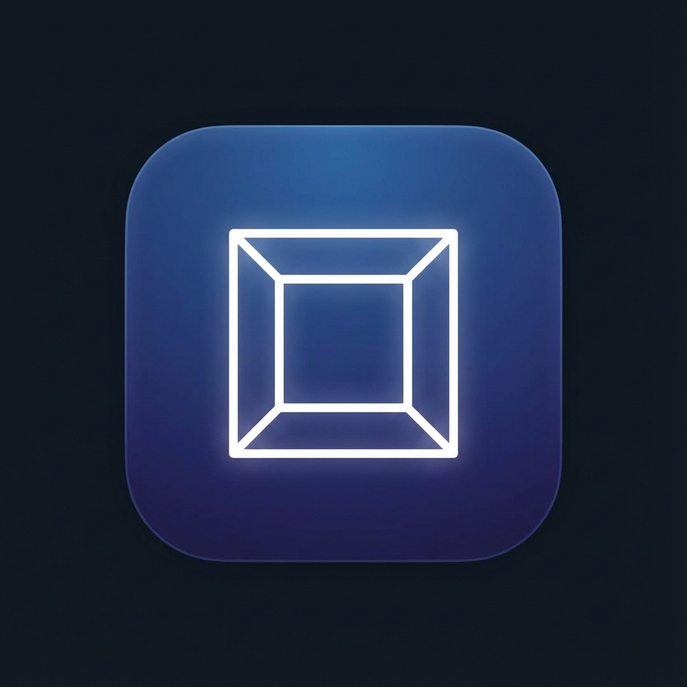

# 🧘 Boxandning

En elegant och minimalistisk webbapp för boxandning (Box Breathing) – en beprövad andningsteknik som används av Navy SEALs, idrottare och stressade kontorsarbetare världen över för att lugna sinnet och förbättra fokus.



## ✨ Funktioner

- **Guidad andning** – Visuella och haptiska ledtrådar guidar dig genom varje fas
- **4-4-4-4 Rytm** – Klassisk boxandningsteknik: Andas in (4s) → Håll (4s) → Andas ut (4s) → Vila (4s)
- **Animerad "Box"** – En visuell fyrkant som expanderar och kontraherar i takt med andningen
- **Ljudsignaler** – Diskreta toner vid varje fasbyte (använder Web Audio API)
- **Haptisk feedback** – Vibrationer på mobilen vid fasbyten och sekundtick
- **Wake Lock** – Skärmen släcks aldrig under en session
- **PWA-stöd** – Installera appen på din hemskärm för en native-liknande upplevelse
- **Mörkt läge** – Skonsamt för ögonen, perfekt för kvällsmeditation
- **Helt på svenska** – Gränssnittet är anpassat för svenska användare

## 🚀 Kom igång

### Krav
- En modern webbläsare (Chrome, Edge, Safari, Firefox)
- En lokal webbserver (på grund av ES Modules)

### Kör appen lokalt

**Alternativ 1: VS Code Live Server**
1. Öppna projektmappen i VS Code
2. Högerklicka på `index.html`
3. Välj "Open with Live Server"

**Alternativ 2: Node.js**
```bash
npx serve .
```
Öppna sedan `http://localhost:3000` i din webbläsare.

**Alternativ 3: Python**
```bash
python -m http.server 8000
```
Öppna sedan `http://localhost:8000` i din webbläsare.

> ⚠️ **Viktigt:** Appen använder ES Modules och måste köras via en server. Att dubbelklicka på `index.html` direkt kommer inte att fungera.

## 📱 Installera som app (PWA)

### Android (Chrome)
1. Öppna appen i Chrome
2. Tryck på menyn (⋮)
3. Välj "Lägg till på startskärmen"

### iOS (Safari)
1. Öppna appen i Safari
2. Tryck på delningsikonen
3. Välj "Lägg till på hemskärmen"

### Desktop (Chrome/Edge)
1. Öppna appen
2. Klicka på installationsikonen i adressfältet
3. Bekräfta installationen

## 🛠️ Teknisk stack

| Teknologi | Användning |
|-----------|------------|
| **HTML5** | Semantisk struktur |
| **Tailwind CSS** | Utility-first styling (via CDN) |
| **Vanilla JavaScript** | ES Modules, MVC-arkitektur |
| **Web Audio API** | Genererar mjuka ljudsignaler |
| **Screen Wake Lock API** | Håller skärmen tänd |
| **Vibration API** | Haptisk feedback |
| **Service Worker** | Offline-stöd och PWA |

## 📁 Projektstruktur

```
box-breathe/
├── index.html          # Huvudsida
├── manifest.json       # PWA-manifest
├── sw.js               # Service Worker
├── favicon.png         # Webbläsarikon
├── README.md           # Denna fil
├── assets/
│   └── icons/          # App-ikoner (192x192, 512x512)
├── css/
│   └── styles.css      # Anpassad CSS & iOS safe-area
└── js/
    ├── app.js          # Huvudkontroller (MVC)
    ├── model.js        # State & timer-logik
    ├── view.js         # UI-uppdateringar & animationer
    └── audio-manager.js # Ljudgenerering
```

## 🎯 Hur boxandning fungerar

Boxandning är en enkel men kraftfull teknik:

1. **Andas in** (4 sekunder) – Fyll lungorna långsamt
2. **Håll andan** (4 sekunder) – Behåll luften
3. **Andas ut** (4 sekunder) – Töm lungorna helt
4. **Vila** (4 sekunder) – Vänta innan nästa andetag

Upprepa i 4-5 minuter för bästa effekt. Tekniken aktiverar det parasympatiska nervsystemet och hjälper kroppen att gå från "fight or flight" till "rest and digest".

## 🔒 Integritet

Appen samlar **ingen data**. Allt körs lokalt i din webbläsare:
- Inga cookies
- Ingen tracking
- Ingen server-kommunikation (förutom att ladda Tailwind CSS från CDN vid första start)

## 📄 Licens

MIT License – Använd fritt, modifiera och dela!

---

Skapad med ❤️ och lugna andetag.